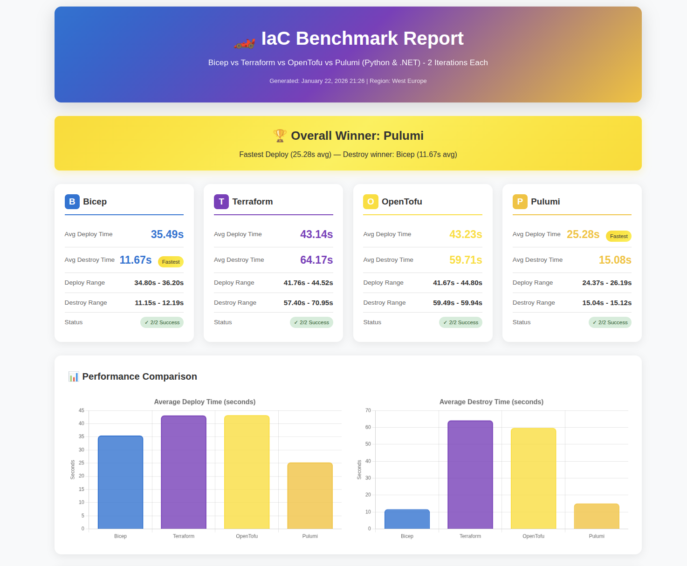

# Azure IaC Benchmark 🏁

A fair, reproducible benchmark comparing deployment speeds of **Bicep**, **Terraform**, **OpenTofu**, and **Pulumi** on Azure.


## 📊 Benchmark Results

Results from 3 iterations on identical Azure resources (January 2026):

<p align="center">
  
</p>

### Deployment Times

| Tool | Min | Max | Average |
|------|-----|-----|---------|
| 🥇 Pulumi | 23.13s | 24.23s | **23.64s** |
| 🥈 Bicep | 34.73s | 35.62s | **35.22s** |
| 🥉 Terraform | 42.15s | 46.81s | **44.15s** |
| OpenTofu | 44.12s | 45.84s | **44.84s** |

### Destroy Times

| Tool | Min | Max | Average |
|------|-----|-----|---------|
| 🥇 Pulumi | 13.55s | 15.17s | **14.12s** |
| 🥈 Bicep | 16.82s | 29.54s | **21.39s** |
| 🥉 Terraform | 60.32s | 61.87s | **60.93s** |
| OpenTofu | 59.42s | 63.23s | **61.15s** |

### 🏆 Winners

- **Fastest Deploy**: Pulumi (23.64s avg) - 49% faster than Bicep, 87% faster than Terraform/OpenTofu
- **Fastest Destroy**: Pulumi (14.12s avg) - 51% faster than Bicep, 332% faster than Terraform/OpenTofu
- **Most Consistent**: Pulumi (smallest variance across iterations)
- **Note**: OpenTofu and Terraform have nearly identical performance (expected as OpenTofu is a Terraform fork)

## 🏗️ Resources Deployed

Each tool deploys identical infrastructure:

- **Virtual Network** with 3 subnets (10.0.0.0/16)
  - Default subnet (10.0.0.0/24)
  - Private subnet (10.0.1.0/24)
  - Private subnet 2 (10.0.2.0/24)
- **Network Security Group** with 3 rules (HTTP, HTTPS, SSH)
- **Storage Account** (Standard_LRS, StorageV2)
- **App Service Plan** (Linux, B1 SKU)
- **Log Analytics Workspace** (30-day retention)

## 🚀 Quick Start

### Prerequisites

| Tool | Installation |
|------|--------------|
| Azure CLI | [Install Guide](https://docs.microsoft.com/en-us/cli/azure/install-azure-cli) |
| Bicep CLI | Included with Azure CLI 2.20.0+ |
| Terraform | [Download](https://www.terraform.io/downloads) (v1.0+) |
| OpenTofu | [Install Guide](https://opentofu.org/docs/intro/install/) (v1.6+) |
| Pulumi | [Install Guide](https://www.pulumi.com/docs/get-started/install/) (v3.0+) |
| Python | 3.8+ (for Pulumi) |

### One-Command Setup

```bash
# Clone the repo
git clone https://github.com/mwhooo/azure-iac-benchmark.git
cd azure-iac-benchmark

# Run setup (creates resource groups, initializes all tools)
./setup.sh
```

The setup script will:
1. ✅ Check all prerequisites are installed
2. ✅ Verify Azure CLI login
3. ✅ Create 4 resource groups (one per tool)
4. ✅ Initialize Terraform with providers
5. ✅ Initialize OpenTofu with providers
6. ✅ Create Pulumi virtual environment and stack
7. ✅ Verify Bicep templates compile

### Run Benchmark

```bash
# Run 3 iterations (default)
./run-iterations.sh

# Run 5 iterations for more statistical significance
./run-iterations.sh 5
```

Results are saved to `results/` directory:
- **JSON**: `benchmark_TIMESTAMP.json` - Raw data for programmatic access
- **HTML**: `benchmark_TIMESTAMP.html` - Interactive report with charts (auto-opens in browser)

## 📁 Project Structure

```
azure-iac-benchmark/
├── bicep/                    # Bicep templates
│   ├── main-template.bicep
│   ├── main-template.bicepparam
│   └── bicep-modules/        # Reusable modules
├── terraform/                # Terraform configuration
│   ├── main.tf
│   ├── variables.tf
│   ├── outputs.tf
│   └── providers.tf
├── opentofu/                 # OpenTofu configuration (Terraform-compatible)
│   ├── main.tf
│   ├── variables.tf
│   ├── outputs.tf
│   └── providers.tf
├── pulumi/                   # Pulumi Python project
│   ├── __main__.py
│   ├── Pulumi.yaml
│   ├── Pulumi.benchmark.yaml # Stack configuration
│   └── requirements.txt
├── results/                  # Benchmark results (gitignored)
│   ├── benchmark_*.json      # Raw timing data
│   └── benchmark_*.html      # Interactive HTML reports
├── setup.sh                  # One-command setup
├── run-iterations.sh         # Multi-iteration benchmark
└── run-benchmark.sh          # Single benchmark with options
```

## 📊 HTML Reports

After running the benchmark, an interactive HTML report is automatically generated and opened in your browser.

**Features:**
- 🏆 **Winner banner** with overall champion
- 📊 **Tool cards** with deploy/destroy times and ranges  
- 📈 **Bar charts** comparing average deploy and destroy times
- 📉 **Line chart** showing performance consistency per iteration
- ⚖️ **Comparison table** with percentage differences vs winner

Reports are saved to `results/benchmark_TIMESTAMP.html` and can be shared or archived.

## ⚙️ Configuration

### Custom Location

```bash
# Set location before running setup
export LOCATION=eastus
./setup.sh
```

### Custom Resource Groups

```bash
export BICEP_RG=my-bicep-rg
export TERRAFORM_RG=my-terraform-rg
export OPENTOFU_RG=my-opentofu-rg
export PULUMI_RG=my-pulumi-rg
./setup.sh
```

## 🔍 Why These Results?

### Pulumi's Speed Advantage

1. **Azure Native Provider** - Direct ARM API calls without translation layers
2. **Parallel Execution** - Deploys independent resources simultaneously
3. **Efficient State Management** - Optimized diffing algorithms
4. **Native Destroy** - Built-in resource deletion vs manual cleanup

### Terraform's Consistency

- Most consistent deploy times (lowest variance)
- Mature provider with predictable behavior
- Slower destroy due to strict dependency ordering

### Bicep's Variability

- Native Azure tool, no additional runtime
- Higher variance due to ARM deployment engine
- No native destroy command (requires manual resource deletion)

### OpenTofu Comparison

- Open-source fork of Terraform (MPL 2.0 license)
- Uses same HCL configuration language
- Compatible with Terraform providers
- Community-driven development
- Performance should be very similar to Terraform

## 📈 Methodology

- All tools deploy to **separate resource groups** in the same region
- Timing measured with `date +%s.%N` (nanosecond precision)
- Each iteration: **full deploy → verify → full destroy**
- Output suppressed to eliminate I/O timing differences
- Same Azure subscription and network conditions
- Resources verified identical across all four tools

## 🧹 Cleanup

Remove all benchmark resources:

```bash
az group delete -n azure-iac-benchmark-bicep-rg --yes --no-wait
az group delete -n azure-iac-benchmark-terraform-rg --yes --no-wait
az group delete -n azure-iac-benchmark-opentofu-rg --yes --no-wait
az group delete -n azure-iac-benchmark-pulumi-rg --yes --no-wait
```

## 🤝 Contributing

Contributions welcome! Ideas for improvement:

- [x] ~~Add OpenTofu to the comparison~~
- [ ] Add AWS CDK / CloudFormation comparison
- [ ] GitHub Actions workflow for automated benchmarks
- [ ] More complex infrastructure scenarios
- [ ] Cost comparison alongside speed
- [ ] Memory/CPU usage during deployments

## 📄 License

MIT License - see [LICENSE](LICENSE) for details.

---

*Benchmark conducted on Azure West Europe region. Your results may vary based on region, subscription type, and network conditions.*
